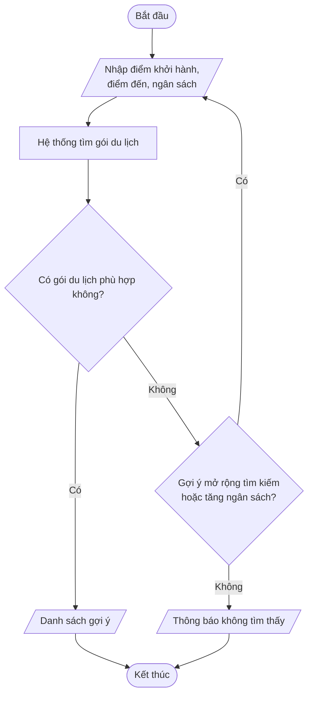
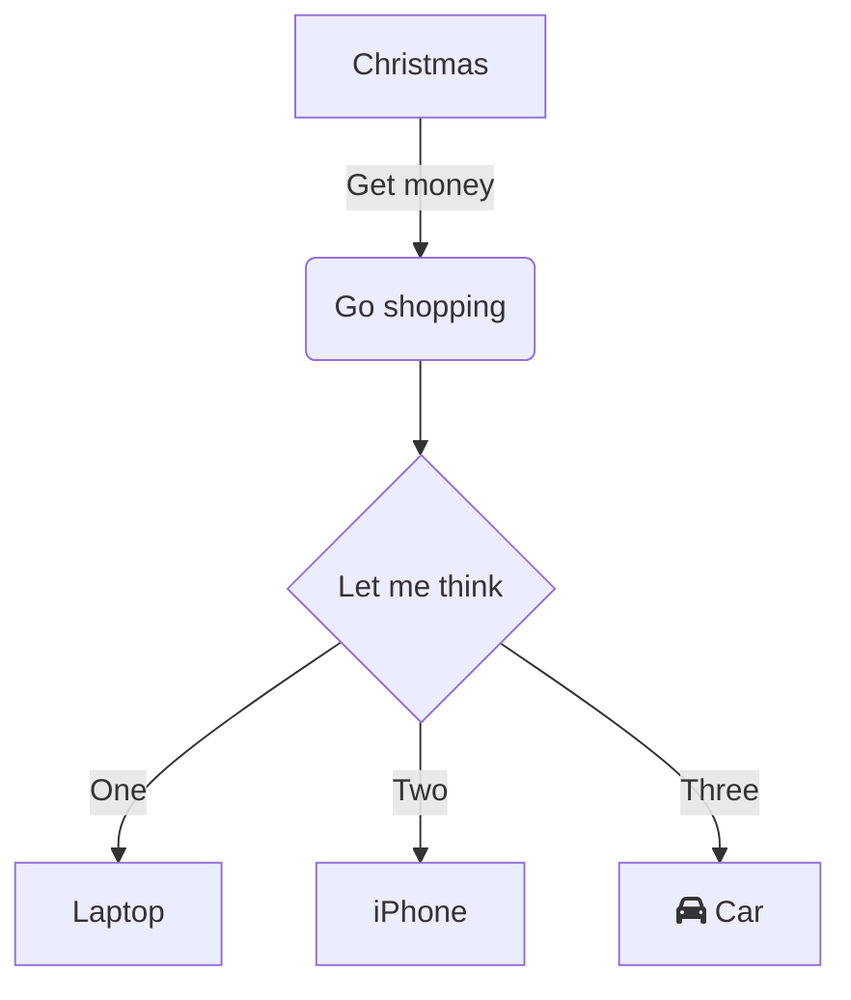

```mermaid
flowchart TD
    S([Bắt đầu]) --> A[/Nhập điểm khởi hành, <br/>điểm đến, ngân sách/];
    A --> B[Hệ thống tìm gói du lịch];
    B --> C{Có gói du lịch phù hợp không?};
    C -- Có --> D[/Danh sách gợi ý/];
    C -- Không --> F{Gợi ý mở rộng tìm kiếm <br/>hoặc tăng ngân sách?};
    D --> E([Kết thúc]);
    F -- Không --> G[/Thông báo không tìm thấy/];
    F -- Có --> A 
    %% Vòng lặp: Quay lại bước nhập liệu để thử lại
    G --> E

```

```mermaid
flowchart TD
    A[Christmas] -->|Get money| B(Go shopping)
    B --> C{Let me think}
    C -->|One| D[Laptop]
    C -->|Two| E[iPhone]
    C -->|Three| F[fa:fa-car Car]
```