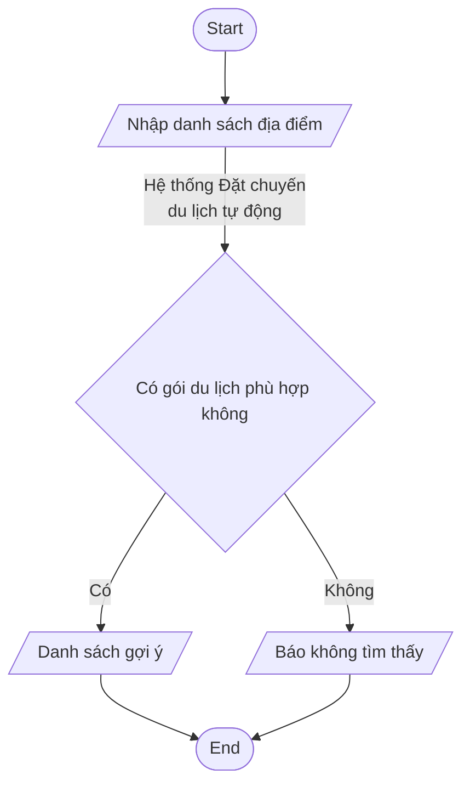

```mermaid
flowchart TD
S([Start]) --> A[/Nhập danh sách địa điểm/]

A -- Hệ thống Đặt chuyến <br/>du lịch tự động --> B{Có gói du lịch phù hợp không}


B --> |Có| C[/Danh sách gợi ý/]
B --> |Không| D[/Báo không tìm thấy/]
C --> E([End])
D --> E([End])


```